# Cardstack

A terminal (TUI) kanban board, written in Rust. Boards made of columns, columns
made of cards, driven entirely from the keyboard.

## Features

- Three-column board per project: `Open`, `InProgress`, `Done`
- Cards colorized by category, with due dates, labels, and a multi-line
  description that wraps and grows the card to fit
- Multiple boards, switchable via tabs, with manual and persisted tab order
- A `:` command line for board/category management, alongside direct
  keybindings for everything else
- Filter the board by category and/or label — with AND/OR label combos — via
  `:filter`, with the active filter shown at a glance
- Autosave on every change — no explicit save, no unsaved-state to lose

## Install / run

```sh
cargo build --release
cargo run
```

Boards are stored as one TOML file each under the platform config directory
(e.g. `~/.config/cardstack/boards/` on Linux). A `Default` board is created
automatically on first run. Only one instance may run at a time; a second
instance refuses to start while the config directory is locked.

## Keybindings

### Board view

| Key | Effect |
|---|---|
| `h` / `←`, `l` / `→` | Move column focus |
| `j` / `↓`, `k` / `↑` | Move card focus within the column |
| `H` / `shift+←`, `L` / `shift+→` | Move the focused card's status left/right |
| `J` / `shift+↓`, `K` / `shift+↑` | Reorder the focused card within its column |
| `Enter` | Open the focused card |
| `d` | Delete the focused card (with confirmation) |
| `:` | Enter command mode |
| `Esc` | Clear the active filter, if one is set |
| `q` | Quit |

### Board tabs

| Key | Effect |
|---|---|
| `[` / `]` (or scroll) | Switch to the previous/next board |
| `Ctrl+T` then a digit | Jump directly to that board's tab index |

### Dialogs (task detail / categories / confirm)

| Key | Effect |
|---|---|
| `Tab` / `shift+Tab` | Move between fields |
| `Enter` (on the confirm control) | Apply |
| `Esc` | Close without applying |

## Commands

| Command | Effect |
|---|---|
| `:new-task` | Open the task detail dialog blank |
| `:new-board <name>` | Create and switch to a new empty board |
| `:rename <name>` | Rename the active board |
| `:swap <i> <j>` | Swap the tab positions of two boards |
| `:delete` | Delete the active board (with confirmation) |
| `:categories` | Open the category-management dialog |
| `:filter <condition>` | Filter cards by category/label (blank or `:filter clear` clears) |
| `:q` | Quit |

`:filter` conditions are space-separated `key=value` terms — `category=<name>`
and `label=<name>`, each at most once, ANDed together. A value may list
alternatives with `|` (any match), e.g. `category=work|home`; a `label=` value
may instead use `&` for "all present", e.g. `label=bug&urgent`. `&` and `|`
can't be mixed in one value. Matching is case-insensitive. `:filter`,
`:filter clear`, or `Esc` clears the active board's filter.

See [`docs/specs/tui/api-contract.md`](./docs/specs/tui/api-contract.md) for
the full, authoritative keybinding/command reference.

## Development

This project is spec-driven: [`AGENTS.md`](./AGENTS.md) is the entry point for
the workflow, [`docs/specs/`](./docs/specs/) is the authoritative behavior
spec, and [`ARCHITECTURE.md`](./ARCHITECTURE.md) covers the code layout. See
[`CONTRIBUTING.md`](./CONTRIBUTING.md) for setup and conventions.

```sh
cargo check
cargo test
cargo clippy -- -D warnings
cargo fmt --check
```

## License

MIT — see [`LICENSE`](./LICENSE).
